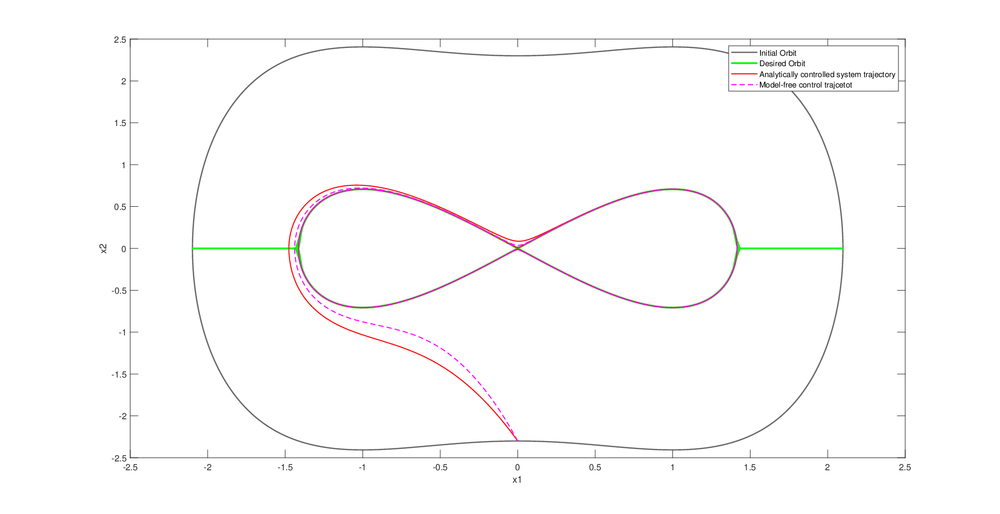

# Koopman-Based Control of a Duffing Oscillator

**Houman Asgari · Nonlinear Control course project · Sharif University of Technology · 2020**

A MATLAB study of nonlinear control using Koopman eigenfunctions. The project investigates how a conserved energy function can be identified from simulated trajectories and used to regulate the motion of a Duffing oscillator.

The work builds on a Brunton textbook example and the **Koopman Reduced-Order Nonlinear Identification and Control (KRONIC)** framework of Kaiser, Kutz, and Brunton. It brings together the mathematical formulation, MATLAB implementation, simulation results, and analysis of analytical and data-driven control.

**[Read the project report](report/Report.pdf)** · **[Implementation notes](docs/technical-notes.md)** · **[References and attribution](THIRD_PARTY_NOTICES.md)**

## Project overview

The controlled Duffing oscillator is described by

$$\dot{x}_1=x_2,\qquad \dot{x}_2=x_1-x_1^3+u.$$

Without actuation, its Hamiltonian is conserved:

$$H(x)=\frac{1}{2}x_2^2-\frac{1}{2}x_1^2+\frac{1}{4}x_1^4.$$

This conserved quantity is a zero-eigenvalue eigenfunction of the continuous-time Koopman generator. With the control input applied to the second state, the energy evolves according to

$$\dot{H}=x_2u.$$

The project uses this relationship to investigate regulation toward the zero-energy separatrix. It compares a controller based on the analytical Hamiltonian with one using an eigenfunction identified from trajectory data, then examines a conventional LQR baseline designed around the origin.

## Methods

- Simulate nonlinear trajectories using MATLAB's `ode45`.
- Construct a library of 14 polynomial observables through degree four.
- Identify a conserved quantity using singular value decomposition.
- Estimate the continuous-time Koopman generator using least squares.
- Estimate trajectory derivatives with fourth-order central differences.
- Compare analytical and data-driven energy regulation with linearized LQR behavior.

The identified eigenfunction is approximately

$$\phi(x)=-\frac{2}{3}x_1^2+\frac{2}{3}x_2^2+\frac{1}{3}x_1^4=\frac{4}{3}H(x).$$

The multiplicative factor is an allowed eigenfunction scaling; a consistent control-cost comparison must account for it.

## Simulation result



*Original 2020 simulation export. The analytical and data-driven controlled trajectories approach the target energy level. The green target curve contains historical plotting artifacts described in the implementation notes.*

An important observation in the report is that **energy regulation and stabilization at the origin have different objectives**. The comparison with conventional LQR illustrates their different behavior; it does not establish that either controller is superior.

## Files

| File or folder | Purpose |
| --- | --- |
| `SystemCreator_RunThisFirst.m` | Simulate the unforced oscillator and identify its conserved quantity |
| `ControllerDesign.m` | Identify the energy coordinate from trajectory data and study feedback control |
| `utils/` | Polynomial libraries, their derivatives, and coefficient display |
| `report/Report.pdf` | Six-page course report; student number removed from this public copy |
| `figures/` | PNG previews and original EPS exports in `figures/source/` |
| `docs/technical-notes.md` | File descriptions, reproduction status, and known limitations |
| `tools/audit_koopman.m` | Later numerical checks of identification and helper functions |

## Running the identification

**Requirements:** MATLAB. The controller and numerical audit also require Control System Toolbox. The historical figures were exported with MATLAB R2019b; the identification audit was run with R2025b.

Open this repository folder in MATLAB and run:

```matlab
SystemCreator_RunThisFirst
```

The original script generates its own simulated data and prints the discovered coefficients. It clears the workspace and closes existing figures.

### Controller archive status

The historical controller script is preserved as submitted. A complete run currently requires the missing `color_line3` and `evalCostFun` helpers. It also depends on the first script's workspace and has coefficient-consistency and plotting issues documented in [the technical notes](docs/technical-notes.md). The full controller has not been revalidated end to end in this archive.

### Reproduce the later numerical checks

From the repository folder:

```matlab
addpath('tools');
metrics = audit_koopman;
```

This writes `docs/validation-results.json`. The audit verifies invariant identification and the polynomial derivative helpers; it does not run the complete controller. In the noiseless simulated example, the sign-aligned coefficient errors were approximately `5.5e-15` with exact derivatives and `3.5e-8` with estimated derivatives. These are identification checks, not closed-loop performance scores.

## Project history and credits

The MATLAB project and report were completed in **2020** for the Nonlinear Control course. The six MATLAB files and four EPS exports are preserved unchanged. Documentation, PNG previews, and numerical checks were added during repository preparation in 2026. The scientific content of the report is unchanged.

This project adapts published examples and code. Original notices are retained, and the upstream KRONIC license is included in [licenses/KRONIC-LICENSE.txt](licenses/KRONIC-LICENSE.txt). See [THIRD_PARTY_NOTICES.md](THIRD_PARTY_NOTICES.md) for attribution and provenance.

- E. Kaiser, J. N. Kutz, and S. L. Brunton, [Data-driven discovery of Koopman eigenfunctions for control](https://arxiv.org/abs/1707.01146).
- [KRONIC source repository](https://github.com/eurika-kaiser/KRONIC).
- S. L. Brunton, J. L. Proctor, and J. N. Kutz, *Discovering governing equations from data by sparse identification of nonlinear dynamical systems*, credited in the supplied coefficient-display helper.
